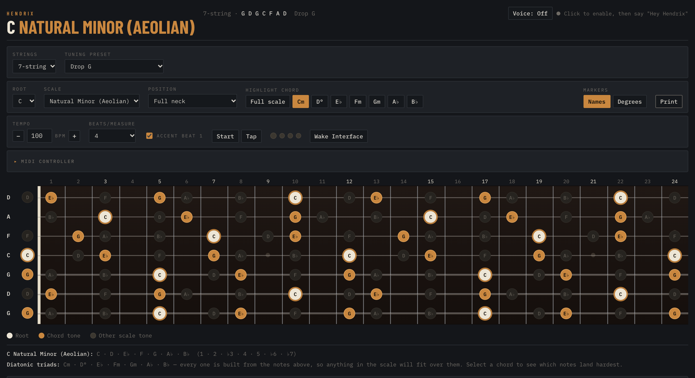
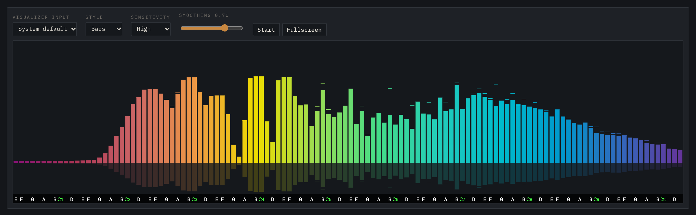

<p align="center">
  
</p>

<h1 align="center">Hendrix</h1>

<p align="center">
  <strong>A fretboard scale mapper that listens.</strong><br>
  See every scale, mode, and chord across the whole neck on 4–8 string guitars and basses —<br>
  then drive it hands-free with your voice or a MIDI controller while you play.
</p>

<p align="center">
  
</p>

---

Most scale charts stop at six strings, standard tuning, and the first twelve frets. Hendrix maps **any scale onto your actual instrument** — your string count, your tuning, all 24 frets — and lights up exactly where the root, the chord tones, and the rest of the scale live.

And because your hands are busy holding a guitar, it doesn't make you reach for the mouse. Say **"Hey Hendrix, switch to F Dorian"**, twist a knob on your MIDI keyboard, or tap a pad — the fretboard follows along.

It's one HTML file. No install, no build step, no account, no framework.

## What it does

### The fretboard
- **4, 5, 6, 7 and 8 strings**, with tuning presets for each — standard, drop, and down-tuned (Drop G 7-string, Drop E 8-string, DADGAD, Open G, bass tunings and more) — plus a fully **custom tuning**, string by string.
- **16 scales:** major and natural minor, all seven modes, harmonic and melodic minor, Phrygian dominant, major and minor pentatonic, blues, whole tone, diminished, and chromatic — in all 12 keys.
- **Chord highlighting:** click any diatonic triad (Cm, D°, E♭…) and watch its tones light up everywhere on the neck, with the chord's root ringed.
- **Positions:** pick 1st through 21st position and everything outside that four-fret box fades back, so you can drill one shape at a time.
- **Names or degrees:** label every dot as a note name or as a scale degree (1, ♭3, 5…).
- **Print it:** a clean, ink-friendly landscape sheet for the music stand.

### Practice tools
- **Metronome** from 30–300 BPM with tap tempo, 1–8 beats per measure, an optional accented downbeat, and a look-ahead Web Audio scheduler that stays locked in time.
- **Live visualizer** powered by [audioMotion-analyzer](https://github.com/hvianna/audioMotion-analyzer). Plug your guitar into your interface and watch your playing as rainbow bars, one per semitone, labeled with note names. Four styles, adjustable sensitivity and smoothing, and a fullscreen mode.

<p align="center">
  
</p>

- **Wake Interface:** some USB audio interfaces nod off during silence and swallow the first few seconds of sound. One button (or MIDI pad) loops a short tone until you stop it — no more blasting audio to get it going.

### Hands-free: "Hey Hendrix"
Turn on voice control and talk to the app while you play. Speech recognition runs **entirely offline, in your browser**, using [Vosk](https://alphacephei.com/vosk/) — your microphone audio never leaves your machine.

| Say "Hey Hendrix, …" | What happens |
| --- | --- |
| "switch to F major" · "play A dorian" | Changes root and scale together |
| "set root to G" · "key to B flat" | Changes the root |
| "harmonic minor" · "minor pentatonic" | Changes the scale |
| "seven strings" · "drop D tuning" | Changes the instrument |
| "highlight chord two" · "highlight C minor" · "full scale" | Highlights a chord |
| "show degrees" · "show names" | Switches the note labels |
| "set tempo to 120" · "three beats" | Sets up the metronome |
| "start the metronome" · "stop the metronome" | Starts or stops it |
| "print" · "help" · "stop listening" | Does what it says |

### MIDI controller
Nearly every control can be driven from a MIDI keyboard or pad controller (built and tested with an Akai MPK). Hendrix uses **MIDI learn**, so there's nothing to configure by hand — click **Learn**, move a knob or hit a pad, done. Mappings are saved in your browser.

- **Knobs:** tempo, string count, tuning, scale, position, beats per measure, highlighted chord.
- **Pads:** metronome start/stop, tap tempo, wake interface, accent on/off, names/degrees.
- **Root Keys:** flip it on and just play a note — any C on the keyboard sets the root to C, any F♯ to F♯. No per-key mapping.

## Quick start

```bash
git clone https://github.com/sharpmachine/Hendrix.git
cd Hendrix
npx live-server --port=8080
```

Then open **http://localhost:8080** in Chrome, Edge, Arc, or another Chromium browser.

No Node? `python3 -m http.server 8080` works too.

> **Why a server instead of double-clicking the file?** Browsers only grant microphone access — needed for voice control and the visualizer — to pages served over `http://localhost` or HTTPS. Opened straight from disk, the fretboard still works, but voice and the visualizer won't.

## Good to know

- **Browser:** Web MIDI and the voice engine need a Chromium-based browser (Chrome, Edge, Arc, Brave). The fretboard itself works anywhere.
- **Picking your interface in Arc:** Arc hides the list of audio inputs from web pages, so the visualizer's dropdown only offers "System default". Choose your interface in **macOS System Settings → Sound → Input** instead — Hendrix shows the name of the input it's hearing next to the Start button.
- **First load:** the voice model (~40 MB) ships in this repo, so recognition stays local. The page pulls its speech and visualizer libraries and its fonts from a CDN, so the first load needs an internet connection.
- **Audio from MIDI pads:** browsers won't start audio until you've clicked or typed on the page once. Do that first and the metronome will start from a pad every time.

## Under the hood

Everything lives in [`index.html`](index.html): vanilla JavaScript, the Web Audio API for the metronome and wake tone, the Web MIDI API with a data-driven MIDI-learn system, [vosk-browser](https://github.com/ccoreilly/vosk-browser) running a Kaldi speech model in WebAssembly, and [audioMotion-analyzer](https://github.com/hvianna/audioMotion-analyzer) for the visualizer.

---

<p align="center"><em>Named for the guitarist who made the fretboard look easy.</em></p>
